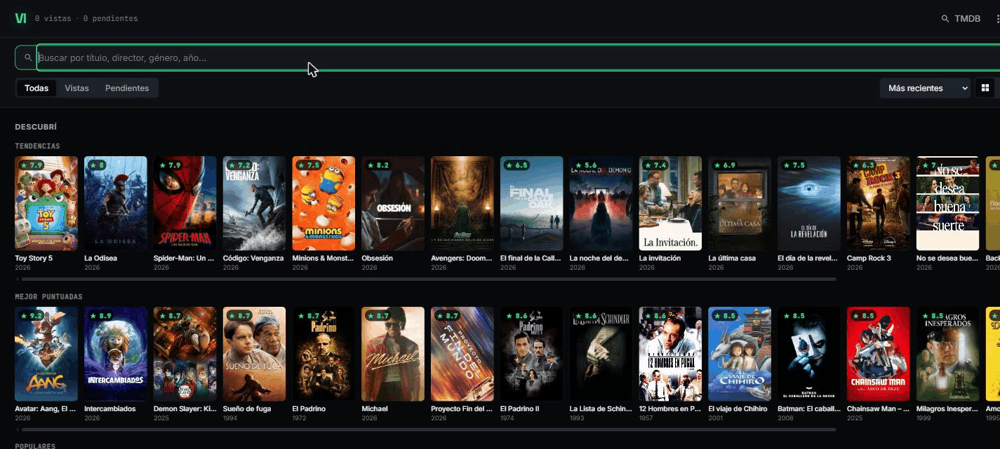
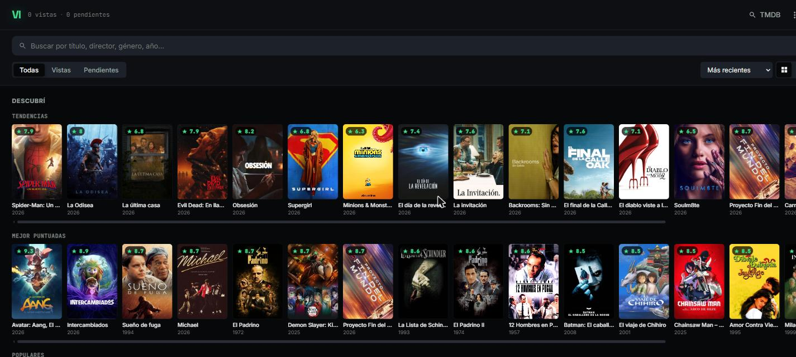
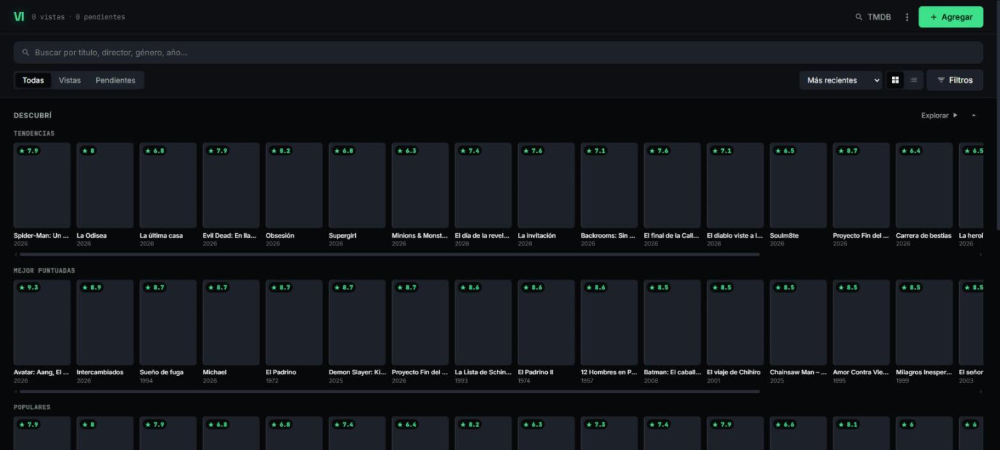

# VI — Videoteca personal

[](https://github.com/bereail/VI/actions/workflows/tests.yml)



Aplicación full-stack para llevar tu propia biblioteca de películas: qué viste, qué querés
ver, tu puntaje y tus notas, con búsqueda de catálogo real vía la API de TMDB. Diseño propio
"cyber-minimal retro" con acentos fósforo/cian/magenta sobre fondo oscuro.

## El problema que resuelve

Las listas de "películas para ver" sueltas en notas o apps genéricas se pierden fácil. VI da
un lugar propio para registrar películas vistas y pendientes, con datos reales (poster,
sinopsis, año, director, género) traídos de TMDB al agregar cada título, más tus propias
notas, puntaje en estrellas y estado.

## Funcionalidades

- **Descubrí**: tendencias y mejor puntuadas de TMDB, para explorar sin buscar nada puntual.
- **Búsqueda** por título, director, género o año contra la API de TMDB.
- **Biblioteca personal**: agregar, editar, marcar como vista/pendiente, puntuar con estrellas.
- **Filtros y vistas**: por estado (vistas/pendientes), ordenamiento, grilla o lista.
- **Estadísticas** de tu biblioteca (panel de stats).
- **Exportar** tu biblioteca como PDF de tarjetas.
- **Atajos de teclado**: `N` nueva, `B` buscar en TMDB, `S` estadísticas, `/` filtrar.
- **Panel de administración** propio, con autenticación JWT.

## Capturas

| Descubrí — Tendencias | Descubrí — Mejor puntuadas |
|---|---|
|  |  |

## Arquitectura

Frontend y backend separados en el mismo repo:

```
src/          # frontend: React 19 + Vite
  hooks/       # useAuth, useMovies, useMovieSearch, useDebounce, useKeyboard, useTheme
  components/  # MovieCard, MovieRow, SearchModal, StatsModal, etc.
  pages/       # LoginPage, LibraryPage, AdminPage
  test/        # tests con Vitest + Testing Library

server/       # backend: Node + Express + PostgreSQL
  routes/      # auth, movies, admin, proxy (a TMDB)
  db.js        # conexión a Postgres (DATABASE_URL por variable de entorno)
  seed.js      # datos iniciales, idempotente (no duplica si ya corrió)
```

- **Auth:** JWT propio (login, registro, reset de contraseña), contraseñas con bcrypt.
- **Deploy:** CI/CD con GitHub Actions — build del frontend, deploy por `rsync` sobre SSH al
  servidor propio, y reinicio del servicio con `systemctl`. Todos los datos de conexión
  (host, usuario, puerto, clave SSH) están en GitHub Secrets, nada hardcodeado.

## Stack

- **Frontend:** React 19, Vite, CSS Modules
- **Backend:** Node.js, Express, PostgreSQL (`pg`), JWT (`jsonwebtoken`), `bcryptjs`
- **Testing:** Vitest, Testing Library, Playwright (E2E)
- **Datos de películas:** [TMDB API](https://www.themoviedb.org/)
- **Exportación:** jsPDF

## Instalación y ejecución local

### Backend

```bash
cd server
npm install
cp .env.example .env   # completar DATABASE_URL y el resto de las variables
npm run seed            # siembra usuarios y películas de ejemplo (idempotente)
npm start
```

### Frontend

```bash
npm install
cp .env.example .env.local   # completar VITE_TMDB_API_KEY (gratis en themoviedb.org)
npm run dev
# abrir http://localhost:5173
```

### Variables de entorno

| Variable | Dónde | Descripción |
|---|---|---|
| `VITE_TMDB_API_KEY` | frontend | API key gratuita de TMDB |
| `DATABASE_URL` | backend | Cadena de conexión a PostgreSQL |
| `SEED_ADMIN_EMAIL` / `SEED_ADMIN_PASSWORD` | backend | Usuario admin creado por `seed.js` |
| `SEED_TEST_EMAIL` / `SEED_TEST_PASSWORD` | backend | Usuario de prueba creado por `seed.js` |

## Testing

**128 tests automatizados** (10 archivos) con Vitest + Testing Library, cubriendo componentes,
hooks y páginas:

```bash
npm test
```

## Roadmap

- [ ] Login social (Google)
- [ ] Recomendaciones basadas en la biblioteca del usuario
- [ ] Modo offline / PWA
